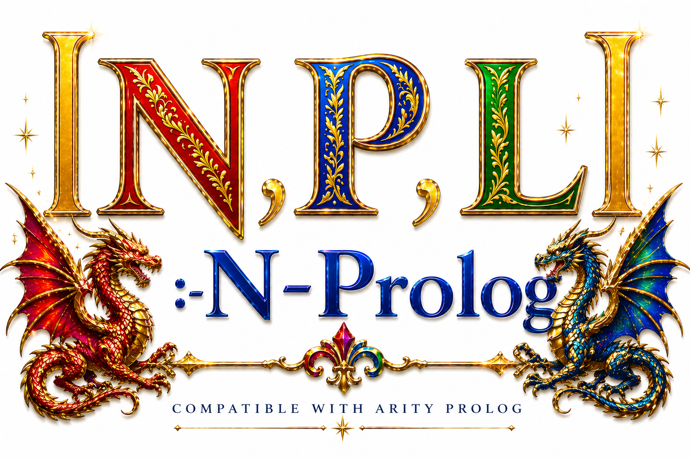

**“This software is a technology created for peace and freedom.  
It does not wish to serve, in any way, as a tool for oppression, suppression, human rights violations, or dictatorship.”**


# N-Prolog
N-Prolog(NPL) is an interpreter and compiler to be superset of ARITY/PROLOG(MS-DOS)

**N-Prolog is NOT ISO-Prolog.** Compatible with ARITY/PROLOG(MS-DOS) see document/NAMUAL.md

license is modified BSD.
Note: We later became aware that another system with the same name, N-Prolog, already existed. This project is unrelated.



## Relation to ISO-Prolog

Although N-Prolog is a superset of ARITY/Prolog, it also implements most ISO-Prolog predicates. In addition, by adding the -d option at startup, strings are represented using double quotes, just as in ISO. For study and educational purposes, ISO-Prolog code can be sufficiently reproduced. Please refer to SUPER.md for details.


## Installation
In home directory ,make clone or download zip file from github.
Change to the git cloned or downloaded N-Prolog directory.

- Type "sudo make install".

Update N-Prolog
- Type "sudo make clean".
- Type "sudo make install".

N-Prolog requires ncurses library. Please install ncurses.

```sh
sudo apt install libncurses-dev
```

# Supported OS:

- Raspberry Pi OS
- Ubuntu
- Linux Mint

- Use of other operating systems is at your own discretion.
Unsupported Operating Systems
Operating systems other than the officially supported ones (Raspberry Pi OS, Ubuntu, Mint) are not officially supported, as I do not have the hardware or sufficient experience to properly test them.
If you wish to run this project on an unsupported OS, please feel free to adapt the code on your own.
If your modifications are successful, we encourage you to publish a branch so that others can benefit from your work.


## File Path Resolution in N-Prolog

When loading files, N-Prolog automatically resolves file paths based on the following rules:

1. **Relative paths** (starting with `./` or `../`) are used directly. If no extension is present, `.pl` is appended.
2. If the environment variable `NPROLOG_HOME` is set, files are loaded from that directory.
3. If `NPROLOG_HOME` is not set but `HOME` is, files are loaded from `$HOME/nprolog/`.
4. Otherwise, the given name is used as-is. If it lacks an extension, `.pl` is appended.

In all cases, if the file name already contains a dot (`.`), it is assumed to include an extension and `.pl` will not be added.


## Uninstall
On Linux type "sudo make uninstall" on terminal.


# invoke
To invoke npl, enter command from terminal

```
npl

-c option is for start up file.

e.g.
npl -c init.pl

-r option is for Not editable REPL mode.
Default, REPL is editable.
```

other option

```
$ npl -h
List of options:
-c filename -- NPL starts after reading the file.
-d          -- string is double quote.
-h          -- display help.
-m N        -- NPL runs with N(30>=N>=10) mega cells.
-n          -- NPL runs with network mode.
-r          -- NPL does not use editable REPL.
-s filename -- NPL runs file with script mode.
-v          -- dislplay version number.
```

## Goal
N-Prolog aims to enjoy the experience of DEC10-Prolog from the 1980s.

## example
```prolog
N-Prolog Ver 4.20
?- length([1,2,3],X).
X = 3
yes


?- X is 2^1000.
X = 107150860718626732094842504906000181056140481170553360744375038837035105112493612249319837881569585812
7594672917553146825187145285692314043598457757469857480393456777482423098542107460506237114187795418215304
6474983581941267398767559165543946077062914571196477686542167660429831652624386837205668069376
yes

?- append(X,Y,[1,2,3]).
X = []
Y = [1,2,3];
X = [1]
Y = [2,3];
X = [1,2]
Y = [3];
X = [1,2,3]
Y = [];
no
?- 
?- ['tests/queens.pl'].
yes
?- test.
....
[9,7,2,4,1,8,5,3,6]
[9,7,3,8,2,5,1,6,4]
[9,7,4,2,8,6,1,3,5]
no
?- 


?- halt.
- good bye -

```

# Editable REPL
key-bindings are as follows:

- → move right
- ← move left 
- ↑ recall history older
- ↓ recall history newer
- return insert end of line
- back-space  backspace
- Esc Tab completion

# unicode
You can use unicode.

```

動物(人間).
人間(ジョー).

動物(X) :- 人間(X).

?- ['tests/animal.pl'].
yes
?- 動物(ジョー).
yes
?- 動物(X).
X = 人間 .
yes

```
