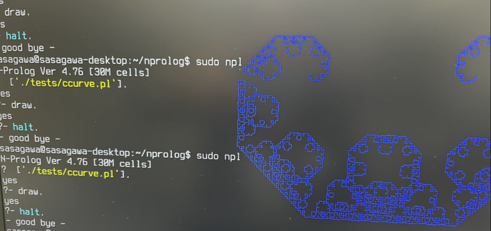
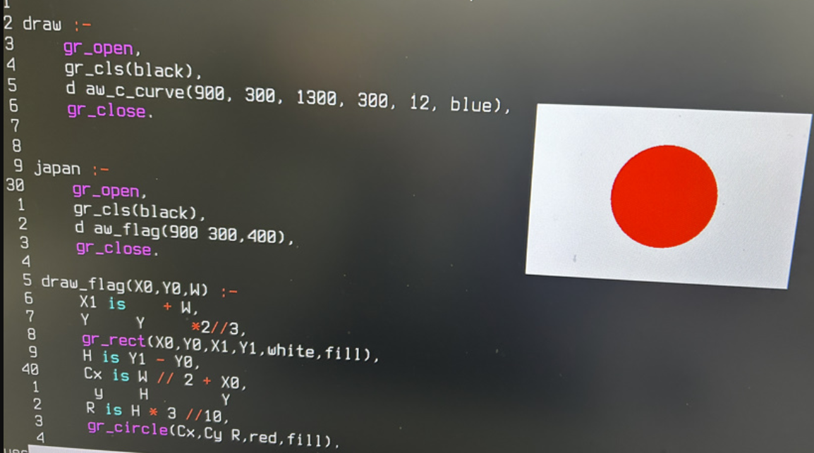

Simple Graphics API using /dev/fb0

This is a simple graphics system utilizing /dev/fb0. It is implemented as a built-in function. Below are the available functions and their specifications.

To use this feature, you need to switch to a physical terminal. You can switch by pressing CTRL+ALT+F3. To return to your original session, press CTRL+ALT+F7.



You need to use sudo when starting it.

```
sudo npl
```

The default font on the TTY is small and hard to read. Therefore, please change the settings as follows next.

```
sudo dpkg-reconfigure console-setup
```
- UTF8
- Terminus
- 16*32


```
% Initialize graphics
gr_open :- 
    % Open the framebuffer
    true.  % Return true if successful, false otherwise

% Close graphics
gr_close :-
    % Close the framebuffer
    true.

% Clear the screen with a specified color
gr_cls(Color) :-
    % Color can be black, blue, red, magenta, green, cyan, yellow, white
    % Screen clearing operation
    true.

% Draw a single pixel
gr_pset(X, Y, Color) :-
    integer(X), integer(Y),
    % Pixel drawing operation
    true.

% Draw a circle
gr_circle(CX, CY, R, Color) :-
    integer(CX), integer(CY), integer(R),
    % Circle drawing operation
    true.
gr_circle(CX, CY, R, Color, fill) :-
    integer(CX), integer(CY), integer(R),
    % Circle drawing with fill
    true.

% Draw a rectangle
gr_rect(X0, Y0, X1, Y1, Color) :-
    integer(X0), integer(Y0), integer(X1), integer(Y1),
    % Rectangle drawing operation
    true.
gr_rect(X0, Y0, X1, Y1, Color, fill) :-
    integer(X0), integer(Y0), integer(X1), integer(Y1),
    % Rectangle drawing with fill
    true.

% Draw a line
gr_line(X0, Y0, X1, Y1, Color) :-
    integer(X0), integer(Y0), integer(X1), integer(Y1),
    % Line drawing operation
    true.
```

# Examples

```
% Draw a C-curve (Koch C-curve)
% draw_c_curve(X0, Y0, X1, Y1, Depth, Color)

draw_c_curve(X0, Y0, X1, Y1, 0, Color) :-
    % Base case: draw straight line
    gr_line(X0, Y0, X1, Y1, Color).

draw_c_curve(X0, Y0, X1, Y1, Depth, Color) :-
    Depth > 0,
    DX is X1 - X0,
    DY is Y1 - Y0,

    % Compute midpoint rotated by +90 degrees
    MX is X0 + DX//2 - DY//2,
    MY is Y0 + DY//2 + DX//2,

    D1 is Depth - 1,

    % Recursive draw
    draw_c_curve(X0, Y0, MX, MY, D1, Color),
    draw_c_curve(MX, MY, X1, Y1, D1, Color).

draw :-
    gr_open,
    gr_cls(black),
    draw_c_curve(900, 300, 1300, 300, 12, blue),
    gr_close.


japan :-
    gr_open,
    gr_cls(black),
    draw_flag(900,300,400),
    gr_close.

draw_flag(X0,Y0,W) :-
    X1 is X0 + W,
    Y1 is Y0 + W*2//3,
    gr_rect(X0,Y0,X1,Y1,white,fill),
    H is Y1 - Y0,
    Cx is W // 2 + X0,
    Cy is H // 2 + Y0,
    R is H * 3 //10,
    gr_circle(Cx,Cy,R,red,fill).

```

