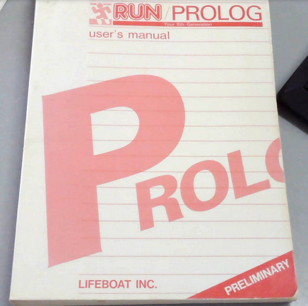
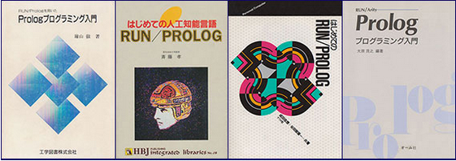

# The History of N-Prolog  

## RUN/PROLOG  
In the 1980s, Prolog gained attention in Japan due to the Fifth Generation Computer Systems project.  
At that time, the Prolog system running on the DEC-10 at the University of Edinburgh was not accessible to the general public.  
Around the same period, a low-cost Prolog interpreter was sold by Lifeboat Associates for approximately $200. Considering that other systems at the time were priced above $1,000, this was relatively inexpensive.  
Lifeboat sold the interpreter portion of ARITY/PROLOG, a product of ARITY Corporation, in Japan under the name **RUN/PROLOG**.  
It is believed to have been the most widely used Prolog system during that time, especially on the PC-9801, the standard personal computer in Japan at the time.  

## Books  
During that period, the most commonly used Prolog systems for personal computers were **RUN/PROLOG** and the Japanese-made **Prolog-KABA**. Prolog-KABA was slightly more expensive, priced at around $700.  
Many books on Prolog were also published.  

While there were many introductory books, some advanced books also existed, such as **"The World of Mathematics Created with Prolog"** by Professor Shigeru Iitaka.  

## N-Prolog  
The developer of **N-Prolog** had an affinity for **RUN/PROLOG**. In the 1980s, ISO-Prolog had not yet been established.  
Based on the RUN/PROLOG user manual from that era, N-Prolog was designed to be as compatible as possible with RUN/PROLOG.  
The system was developed primarily for personal enjoyment, rather than practical use, with a focus on experimenting with code from books published in the 1980s.  

