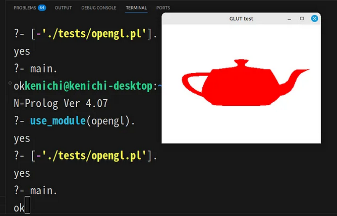

# OpenGL linbrary


# Preparation
The OPenGL library utilizes the C language embedding feature. Therefore, it needs to be compiled first. Please follow the steps below to compile it.

```
make prolog
```

# Usage

```
?- use_module(opengl).
```

# Example

```
main :-
    glut_init,
    glut_init_display_mode(glut_single),
    glut_init_window_size(400,300),
    glut_init_window_position(200,300),
    glut_create_window('GLUT test'),
    glut_init_display_mode(glut_rgba),
    gl_clear_color(1.0,1.0,1.0,1.0),
    glut_display_func(show),
    glut_main_loop.


show :-
    gl_clear(gl_color_buffer_bit),
    gl_color3d(1.0,0.0,0.0),
    gl_begin(gl_line_loop),
    gl_vertex2d(-0.5,-0.5),
    gl_vertex2d(-0.5,0.5),
    gl_vertex2d(0.5,0.5),
    gl_vertex2d(0.5,-0.5),
    gl_end,
    glut_solid_teapot(0.5),
    gl_flush.

```

# Specification

- glut_init:
    Initializes GLUT (OpenGL Utility Toolkit) for use with OpenGL applications.

- glut_init_display_mode(glut_single):
    Sets the display mode to single-buffered.

- glut_init_display_mode(glut_rgba):
    Sets the display mode to RGBA color format.

- glut_init_window_size(Height, Width):
    Initializes the window size with the specified height and width.

- glut_init_window_position(Height, Width):
    Initializes the window position with the specified height and width.

- glut_create_window(X):
    Creates a window with the specified name.

- gl_clear_color(X1, Y1, X2, Y2):
    Sets the clear color for the OpenGL window.

- glut_display_func(X):
    Sets the display function callback for rendering.

- glut_mouse_func(X):
    Sets the mouse function callback for mouse events.

- glut_main_loop:
    Starts the GLUT main loop for handling events and rendering.

- gl_clear(gl_color_buffer_bit):
    Clears the color buffer bit.

- gl_color3d(R, G, B):
    Sets the color for drawing with the specified RGB values.

- gl_begin1(X):
    Begins a drawing operation with the specified mode (e.g., GL_LINE_LOOP).

- gl_begin(gl_line_loop):
    Begins drawing a line loop.

- gl_begin(gl_points):
    Begins drawing points.

- gl_begin(gl_lines):
    Begins drawing lines.

- gl_begin(gl_line_strip):
    Begins drawing a line strip.

- gl_begin(gl_triangles):
    Begins drawing triangles.

- gl_begin(gl_quads):
    Begins drawing quads.

- gl_begin(gl_triangle_strip):
    Begins drawing a triangle strip.

- gl_begin(gl_quad_strip):
    Begins drawing a quad strip.

- gl_begin(gl_triangle_fan):
    Begins drawing a triangle fan.

- gl_begin(gl_polygon):
    Begins drawing a polygon.

- gl_error(P, O):
    Handles errors in drawing operations.

- gl_vertex2d(X, Y):
    Specifies a 2D vertex for drawing.

- gl_vertex3d(X, Y, Z):
    Specifies a 3D vertex for drawing.

- gl_vertex4d(X1, X2, X3, X4):
    Specifies a 4D vertex for drawing.

- glut_solid_cube(X):
    Draws a solid cube with the specified size.

- glut_solid_sphere(X, Y, Z):
    Draws a solid sphere with the specified radius and segments.

- glut_solid_torus(X1, X2, X3, X4):
    Draws a solid torus with the specified inner and outer radii.

- glut_solid_icosahedron:
    Draws a solid icosahedron.

- glut_solid_octahedron:
    Draws a solid octahedron.

- glut_solid_tetrahedron:
    Draws a solid tetrahedron.

- glut_solid_dodecahedron:
    Draws a solid dodecahedron.

- glut_solid_cone(X1, X2, X3, X4):
    Draws a solid cone with the specified base radius, height, and slices.

- glut_solid_teapot(X):
    Draws a solid teapot with the specified size.

- gl_end:
    Ends the current drawing operation.

- gl_flush:
    Flushes the OpenGL commands to the graphics hardware.

- gl_finish:
    Waits for all OpenGL commands to finish.


