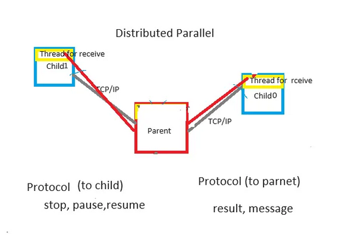

Distributed Parallel functions

# Invoke

npl -n on child machine terminal. N-Prolog runs with network mode.

N-Prolog on parent machine terminal. and dp_create/1 to establish TCP/IP between child Prolog.

# Spec

    npl -n: Launches child Prolog in network mode with the -n option.

    dp_create([c0,c1, …,cn]): Provides IP addresses of child machines to establish TCP/IP communication with the parent Lisp.

    dp-and([p0,p1, ...,pn]): It executes the predicates from P0 to PN in parallel. If all of them return YES, it returns YES. If even one returns NO, it returns NO.

    dp_or([p0,p1, ...,n]): It executes the predicates from P0 to PN in parallel. If any one of them returns YES, it interrupts the other computations and returns YES.

    dp_transfer(Fn): Transfers file Fn to all child machines from the parent machine.

    dp_compile(Fn): Compiles file Fn on both parent and child machines.

    dp_consult(Fn): Loads file Fn on both parent and child machines.

    dp_eval(Nth,Pred): Prove Predicate on the Nth child Prolog for testing.

    dp_report(Str): Display string on parent terminal.

    dp_close: Sends termination command to child machines and closes communication.
