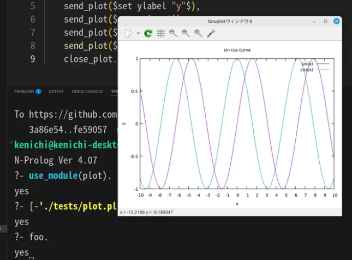

# Plot library


# Preparation
The Plot library utilizes the C language embedding feature. Therefore, it needs to be compiled first. Please follow the steps below to compile it.

```
make prolog
```

# Specification

- open_plot/0

- send_plot(Msg)

- close_plot/0



